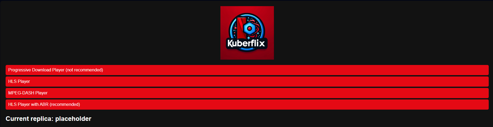
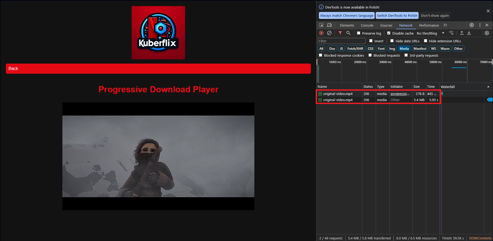
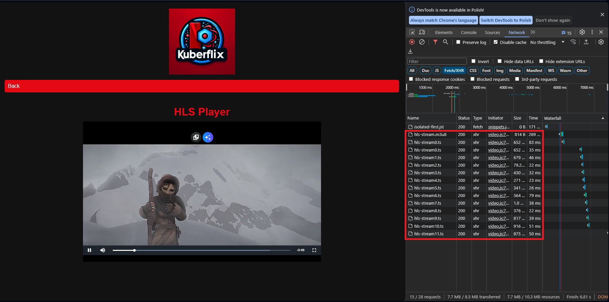
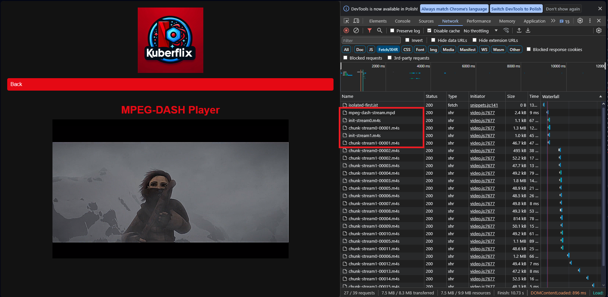
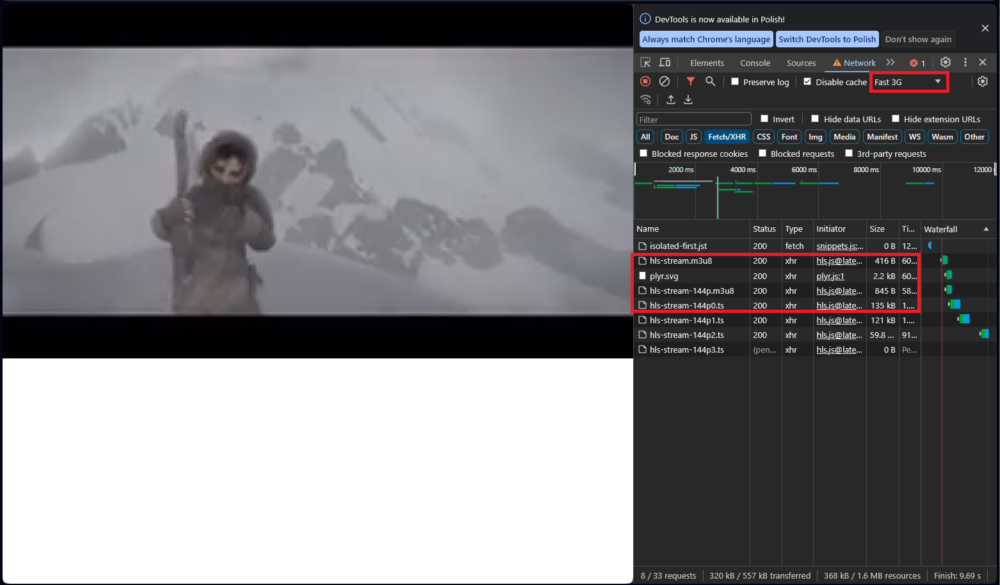
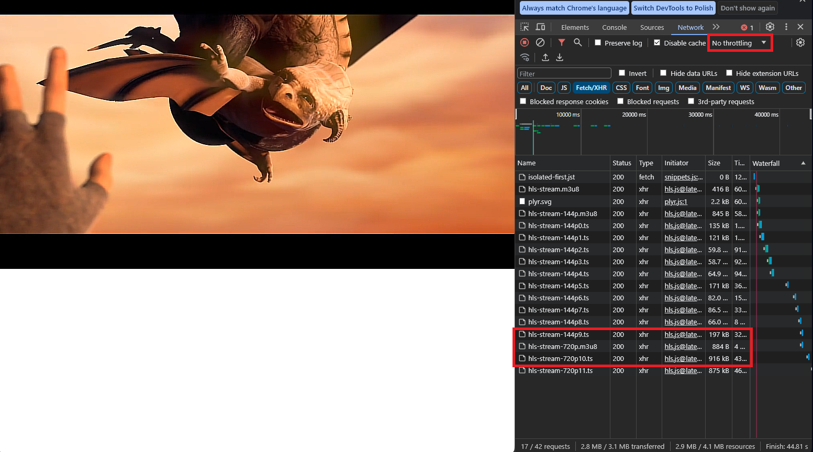

# About the project
The goal of this project is to show different conceptions regarding:
- monitoring Kubernetes applications,
- VOD streaming,
- horizontal scaling on Kubernetes, especially of streaming applications
# Setup
In order to run this project follow these steps:
* Download and install [ffmpeg](https://ffmpeg.org).
* If you'd like to stream your custom video prepare or download appropriate .mp4 file. For example here you can download full BigBuckBunny 10 minutes movie from here: http://commondatastorage.googleapis.com/gtv-videos-bucket/sample/BigBuckBunny.mp4, if not then you can use Sintel Trailer (sinteltrailer.mp4 file) that is provided by default.
* Place the .mp4 file in the *apps/streaming-server/* directory
* In the *apps/streaming-server/* directory run: ```./convert.sh -i MY_MOVIE_FILE.mp4```
* If you're on windows machine you can either configure WSL or make some (faster) workaround by downloading [GIT](https://git-scm.com/downloads). After downloading it you can either run the script from GIT Bash same as above or add a path to sh.exe file (for example: *C:\Program Files\Git\bin*) to PATH variable and run it from powershell like ```sh .\convert.sh -i MY_MOVIE_FILE.mp4```
* To run this app you need to have a prepared Kubernetes cluster. Easiest way to provide it is to run a local one-node cluster called `minikube`. To do that, download minikube and start it with `minikube start`.
* Deploy application by using script shown below. Give it some time to properly deploy all apps on the cluster and youre ready to go.
```
scripts/build_images_and_deploy.sh --rebuild-images --deploy-streaming-server
```
* Use `minikube service streaming-server-service -n streaming-service` to access an application in a browser. It will automatically redirect you to the browser. If not - copy the printed IP with port and paste it in the browser.
* To simulate a workload on a web app use ```kubectl apply -f k8s/helpers/web-load-generator.yaml```. After that you will see HPA automatically deploying all replicas across the node.
* Optionally, if you'd like to run simple streaming-server Docker container without any Kubernetes you can run: ```./init-pure-docker.sh``` in the *streaming-server/* directory and visit the application on *http://localhost:8080*.


# Streaming - theoretical introduction

Before we get into the details of how our streaming application works, let's first discuss  the basics of streaming, its definition, a brief history and the appropriate protocols.

## What is streaming?

In simple words streaming is the continuous delivery of multimedia content from a server to a client.

We can distinguish two ways of accessing streaming data: live and on-demand.
In our project, we will focus on on-demand access, specifically in the form of VOD (Video on Demand). 
The most popular services of this type include Netflix, HBO Max, Hulu, and Disney Plus.

## A brief history of streaming

### Downloading

Downloading is the oldest way of offering video and has little to do with today's streaming. Due to the fact that the meta data summary was located at the end of a media file, the entire file would need to be downloaded in order for the meta data to be read and the player begin playback.

### Progressive download

After relocating the metadata from the end to the beginning of the digital media file, the media player obtained all the necessary information to initiate playback while the file was still being downloaded. This provided an experience similar to today's streaming, but it represents an old method of delivering video, and the basic version of progressive download lacks many functionalities that we commonly find in modern streaming. There have been some improvements to progressive download that make it resemble streaming to a certain extent, this improved version of progressive download is often referred to as pseudostreaming. However, even with these improvements, there is still a significant disadvantage that cannot be overlooked: with progressive download, the file is downloaded to a physical drive on the end user's device, which is undesirable from a copyright perspective.

It's worth to mention that progressive download is natively supported in HTML5 player.

### RTMP

RTMP serves as a communication protocol designed for the streaming of audio, video, and data across the Internet. Initially created as a proprietary protocol by Macromedia to facilitate streaming between Flash Player and the Flash Communication Server, however Macromedia was later acquired by Adobe along with the rights to RTMP protocol.

RTMP was the leading streaming protocol in the mid-2000s. Its major advantage was the widespread installation of Adobe Flash Player, which, as we all know, is no longer the case.
Another significant advantage of RTMP is its low latency. 

However, it also comes with several disadvantages, such as security issues associated with Adobe Flash Player, the fact that it was proprietary, its inability to leverage HTTP-based infrastructure, and its unsuitability for ``Adaptive Bitrate Streaming (ABR)`` which is dynamically adapting content quality to user's bandwith or caching at edge locations with a CDN (Cloud Delivery Network), which significantly enhances the performance of modern streaming.

Even though RTMP is not used when communicating between media server and players due to the lack of Adobe Flash Player in our browsers, it still can and is sometimes used in communication between source encoders and media server.

### HLS

HLS, or HTTP Live Streaming, stands as an HTTP-centric streaming protocol introduced by Apple in 2009. Widely adopted, supported by many media players, web browsers, mobile devices, and streaming media servers. According to bitmovin yearly surveys https://bitmovin.com/wp-content/uploads/2022/12/bitmovin-6th-video-developer-report-2022-2023.pdf it's currently most popular streaming format.

Let's talk a bit about how HLS works. Content, for example some movie, is divided into small chunks, each has a few seconds of video and audio. A manifest file, also knows as playlist file, provides the list of all chunks and some additional data. Manifest and chunks can de either pre-processed (like with movie example) or prepared upon request. First approach is more popular in VOD streaming and second one can be used when we have single live streaming source that can utilize RTMP protocol and then we take this RTMP stream and convert it to HLS stream which can then be delivered directly to the end users (or to their player to be specific).

In HLS the manifest is stored in a file with the .m3u8 extension, which is commonly used for M3U playlist files in the UTF-8 (Unicode) format. Individual segments by default has .ts extension.

HLS supports ``Adaptive Bitrate Streaming (ABR)`` and caching at edge locations with a CDN.

### MPEG-DASH

MPEG-DASH is similar to HLS when it comes to the principle of operation. In MPEG-DASH content is also divided into small chunks but with the .m4s extension and the playlist is a bit more complex and has XML format and .mpd extension. MPEG-DASH also supports ABR and CDN. There are however some differences between HLS and MPEG-DASH:
- HLS is often natively supported by Apple devices, MPEG-DASH is not.
- default segment duration in HLS is 6 seconds but it can be changed which is especially used in LL-HLS (Low Latency HLS), optimal segment duration in MPEG-DASH is 2-4 seconds.
- HLS is Apple proprietary protocol and MPEG-DASH is an international standard (ISO/IEC 23009-1:2022)
- the biggest advantage of MPEG-DASH over HLS is a fact that MPEG-DASH is codec agnostic. It means that it supports any codec standard, meanwhile HLS supports only H.264 and H.265 video encoding and small number of audio encoding standards. Due to this and the previous reason MPEG-DASH is becoming more and more popular

# Streaming application implementation

In this section, we will get into the practical aspects of our project in to provide a clear understanding of HTTP-based streaming protocols like HLS and MPEG-DASH. We'll compare these protocols with progressive downloading and highlight the significance of Adaptive Bitrate Streaming (ABR).
We'll divide this section based on certain components of our streaming application and software, tools, solutions etc. that we used.

## Streams creation

In order to create appropriate HLS and MPEG-DASH streams we used FFmpeg. FFmpeg is a complete, cross-platform solution to record, convert and stream audio and video. We created the manifest file and chunks based on .mp4 file which is a multimedia container format, containing video, audio and also other data such as subtitles, metadata and still images. It support various codecs, for example H.264 for video, AAC for audio and MPEG-4 Timed Text for subtitles.

### HLS
Here are the ffmpeg command that we used in order to create HLS stream:

```
# HLS
ffmpeg -i $INPUT_FILE \
  -vcodec libx264 \
  -acodec aac \
  -start_number 0 \
  -hls_time 3 \
  -hls_list_size 0 \
  -f hls $OUTPUT_PATH/hls/hls-stream.m3u8
```

Let's describe each HLS converting option one by one:

`-i $INPUT_FILE`: Specifies the input file or stream for conversion. As mentioned in previous sections, it does not have to be .mp4 file like in our example, you can use for example RTMP stream as input.

`-vcodec libx264`: Specifies the video codec to H.264. Keep in mind that HLS only supports H.264 and H.265 video codecs so we have to either specify this as we do in ffmpeg option or if we know that the codec in input stream/file is supported by HLS than we can use ``copy`` option as will be done in MPEG-DASH.

`-acodec aac`: Specifies the audio codec to AAC as we are not sure what audio codec the input file/stream uses. Analogical situation to video codec.

`-start_number 0`: Defines the starting number for the segments. In this case, it begins with 0 (from the beginning).

`-hls_time 3`: Sets the duration of each HLS segment to 3 seconds. It's important to note that this duration is not strictly enforced; instead, it functions as a hint, and the actual chunk division depends on the placement of key frames.

`-hls_list_size 0`: This option controls the number of entries in the playlist. A value of 0 implies an unlimited list size, meaning all segments will be listed in the playlist (by default HLS ffmpeg sets limit).

`-f hls $OUTPUT_PATH/hls/hls-stream.m3u8`: Specifies the output format as HLS and saves the resulting stream in the *hls-stream.m3u8* file under the specified output path.

The result .m3u8 playlist looks like that:
```
#EXTM3U
#EXT-X-VERSION:3
#EXT-X-TARGETDURATION:10
#EXT-X-MEDIA-SEQUENCE:0
#EXTINF:5.125000,
hls-stream0.ts
#EXTINF:4.208333,
hls-stream1.ts
#EXTINF:2.625000,
hls-stream2.ts
#EXTINF:1.958333,
hls-stream3.ts
#EXTINF:2.583333,
hls-stream4.ts
#EXTINF:1.666667,
hls-stream5.ts
#EXTINF:3.875000,
hls-stream6.ts
#EXTINF:3.833333,
hls-stream7.ts
#EXTINF:1.541667,
hls-stream8.ts
#EXTINF:3.291667,
hls-stream9.ts
#EXTINF:5.208333,
hls-stream10.ts
#EXTINF:10.416667,
hls-stream11.ts
#EXTINF:1.166667,
hls-stream12.ts
#EXTINF:4.708333,
hls-stream13.ts
#EXT-X-ENDLIST
```

### MPEG-DASH
Here are the ffmpeg command that we used in order to create MPEG-DASH stream:

```
# MPEG-DASH
ffmpeg -i $INPUT_FILE \
  -codec copy \
  -start_number 0 \
  -seg_duration 3 \
  -f dash $OUTPUT_PATH/mpeg-dash/mpeg-dash-stream.mpd
```

`-i $INPUT_FILE`: Analogically as with HLS, specifies the input file or stream for conversion.

`-codec copy`: Notice that we don't specify video or audio codecs because MPEG-DASH is codec-agnostic. This feature is a significant advantage over HLS, which has limited codec support. By avoiding time-consuming re-encoding, MPEG-DASH gains greater flexibility.

`-start_number 0`: Analogically as with HLS. Defines the starting number for the segments.

`-seg_duration 3`: Analogically as with HLS, sets the duration of each MPEG-DASH segment to 3 seconds. Keep in mind that the actual chunk division depends on the placement of key frames.

`-f dash $OUTPUT_PATH/mpeg-dash/mpeg-dash-stream.mpd`: Specifies the output format as MPEG-DASH and saves the resulting stream in the *mpeg-dash-stream.mpd* file under the specified output path.

The result .mpd playlist looks like that:
```
<?xml version="1.0" encoding="utf-8"?>
<MPD xmlns:xsi="http://www.w3.org/2001/XMLSchema-instance"
	xmlns="urn:mpeg:dash:schema:mpd:2011"
	xmlns:xlink="http://www.w3.org/1999/xlink"
	xsi:schemaLocation="urn:mpeg:DASH:schema:MPD:2011 http://standards.iso.org/ittf/PubliclyAvailableStandards/MPEG-DASH_schema_files/DASH-MPD.xsd"
	profiles="urn:mpeg:dash:profile:isoff-live:2011"
	type="static"
	mediaPresentationDuration="PT52.2S"
	maxSegmentDuration="PT3.0S"
	minBufferTime="PT9.8S">
	<ProgramInformation>
		<Title>Sintel Trailer</Title>
	</ProgramInformation>
	<ServiceDescription id="0">
	</ServiceDescription>
	<Period id="0" start="PT0.0S">
		<AdaptationSet id="0" contentType="video" startWithSAP="1" segmentAlignment="true" bitstreamSwitching="true" frameRate="24/1" maxWidth="1280" maxHeight="720" par="16:9" lang="und">
			<Representation id="0" mimeType="video/mp4" codecs="avc1.64001f" bandwidth="1033716" width="1280" height="720" sar="1:1">
				<SegmentTemplate timescale="12288" initialization="init-stream$RepresentationID$.m4s" media="chunk-stream$RepresentationID$-$Number%05d$.m4s" startNumber="1">
					<SegmentTimeline>
						<S t="0" d="114688" />
						<S d="56320" />
						<S d="128000" />
						<S d="37888" />
						<S d="58368" />
						<S d="128000" />
						<S d="60416" />
						<S d="57856" />
					</SegmentTimeline>
				</SegmentTemplate>
			</Representation>
		</AdaptationSet>
		<AdaptationSet id="1" contentType="audio" startWithSAP="1" segmentAlignment="true" bitstreamSwitching="true" lang="und">
			<Representation id="1" mimeType="audio/mp4" codecs="mp4a.40.2" bandwidth="126694" audioSamplingRate="48000">
				<AudioChannelConfiguration schemeIdUri="urn:mpeg:dash:23003:3:audio_channel_configuration:2011" value="2" />
				<SegmentTemplate timescale="48000" initialization="init-stream$RepresentationID$.m4s" media="chunk-stream$RepresentationID$-$Number%05d$.m4s" startNumber="1">
					<SegmentTimeline>
						<S t="0" d="144384" r="16" />
						<S d="38912" />
					</SegmentTimeline>
				</SegmentTemplate>
			</Representation>
		</AdaptationSet>
	</Period>
</MPD>
```

As you can see it's indeed more complex than HLS playlist. Also notice that MPEG-DASH conversion in ffmpeg by default creates separate adaptation sets for video and audio which might be useful in case of having multiple languages versions of video.


### Measurements

We've performed measurements to see how really time-consuming re-encoding of video and audio is. 

It turned out that conversion to HLS with re-encoding took on average more than 31 seconds. In MPEG-DASH, without re-encoding, it was on average less than one second.

Keep in mind that time measurements may vary on different machines, however the difference between conversion with re-encoding and without it is undeniably visible. 

Don't forget that we can also avoid re-encoding with HLS if we know that input codecs are supported by HLS. We performed tests on HLS without re-encoding and the results were similar to MPEG-DASH without re-encoding, less than one second on average. The obvious drawback is the fact that we have to exactly know what codecs are used in input file/stream with HLS and we do not have care about it with MPEG-DASH as it's codec-agnostic.

### Adaptive Bitrate Streaming

Adaptive Bitrate Streaming (ABR) is a video streaming technique designed to provide a smoother and more reliable viewing experience for users by dynamically adjusting the quality of the video based on their network conditions. The key idea behind ABR is to adapt the bitrate (the amount of data transmitted per second) of the video stream in real-time, allowing for optimal playback without interruptions.

In order to show Adaptive Bitrate Streaming in action we have to first generate appropriate streams with different qualities. For demonstation purposes we've decided to use 144p quality and 720p quality in order to show visible difference between the video quality.

Here is the ffmpeg command we used to create the stream with 144p quality:

```
# HLS with ABR
ffmpeg -i $INPUT_FILE \
  -c:a aac \
  -c:v libx264 \
  -profile:v high \
  -level:v 4.0 \
  -s 256x144 \
  -start_number 0 \
  -hls_time 3 \
  -hls_list_size 0 \
  -f hls $OUTPUT_PATH/hls-abr/hls-stream-144p.m3u8
```

We used HLS as our streaming protocol, we've specified appropriate codecs with ``-c:a`` and ``-c:v`` options (shorter alternative to ``-acodec`` and ``-vcodec``). Let's discuss options that were not described before:
- ``-profile:v high``: H.264 includes a number of different sets of capabilities, or "profiles". All of these profiles rely heavily on temporal compression and motion prediction to reduce frame count. The three most commonly applied profiles are Baseline, Main, and High. Each of these profiles defines the specific encoding techniques and algorithms used to compress files. In our example it's High profile which provides the highest compression.
- ``-level:v 4.0``: Level is a specified set of constraints that indicate a degree of required decoder performance for a profile. For example, a level of support within a profile specifies the maximum picture resolution, frame rate, and bit rate that a decoder may use. A decoder that conforms to a given level must be able to decode all bitstreams encoded for that level and all lower levels. For 144p the level could be lower, however you can encounter problems with ABR in case of using different levels for different qualities, therefore it should be kept the same across different resolutions.
- ``-s 256x144``: Specifiec output resolution to 256x144 (144p).

We've performed analogical conversion for 720p quality.

If we already have streams with desired qualities we have to create master playlist which will contain the playlist for every quality. The master playlist looks like that:
```
#EXTM3U
#EXT-X-STREAM-INF:BANDWIDTH=50000,RESOLUTION=256x144
hls-stream-144p.m3u8
#EXT-X-STREAM-INF:BANDWIDTH=2000000,RESOLUTION=1280x720
hls-stream-720p.m3u8
```
as you can see, you have specific quality assigned to certain bandwith.

It's worth to mention that FFmpeg allows us to improve conversion performance. For example, we can use multiple threads which can be especially useful with creating multiple resolution HLS/MPEG-DASH streams from RTMP live stream.


## Streaming server

We've decided to use NGINX web server as our streaming media server. What may be surprising, according to W3Techs' survey (https://w3techs.com/technologies/overview/web_server) and various other statistics, NGINX the most widely used web server. Many people may think that Apache is the most popular one. 

NGINX's popularity is associated with its effectiveness in handling high-performance tasks and concurrent connections, scalability, reliability and much more.

NGINX is organized using modules, and its behavior is guided by instructions specified in the configuration file. These instructions come in two types: simple directives and block directives. A simple directive consists of a name and parameters separated by spaces, concluding with a semicolon (;). On the other hand, a block directive follows the same structure but uses braces ({ and }) instead of a semicolon, enclosing a set of additional instructions. When a block directive can include more directives within its braces, it's termed a context (e.g., events, http, server, and location). Directives placed outside of any contexts in the configuration file are considered part of the main context. In this setup, events and http directives reside in the main context, server in http, and location in server. Any text following a # sign is regarded as a comment.

### Our streaming server configuration
Configuration file for our streaming server is pretty simple:

```
events {}
http {
	server {
    listen 8080;
    location / {
      types {
        application/vnd.apple.mpegurl m3u8;
        video/mp2t ts;
        application/dash+xml mpd;
        video/mp4 mp4;
        text/css css;
        text/html html;
      }
	  root /usr/local/nginx/html;
    }
  }
}
```

Let's explain this in details:

Explanation:

``events {}``: This block is usually used for configuring global settings related to events. In this example, it's empty, indicating that there are no specific global event configurations.

``http {}``: This block contains settings related to the HTTP server. It's the starting point for defining how the server handles HTTP requests.

``server {}``: Inside the http block, this is a server block. It defines the configuration for a specific virtual server, which can handle requests for a particular domain or IP address.

``listen 8080;``: Configures the server to listen on port 8080 for incoming HTTP requests.

``location / {}``: This block defines settings for a specific URL location. In this case, it's the root location ("/").

``types {}``: Defines MIME types for content negotiation in this location.

``root /usr/local/nginx/html;``: Sets the root directory for serving files in this location. Requests to this location will look for files within the specified directory on the server. By default it will take file named index.html from this location as the main page.

## Players

In order to create video players for HLS and MPEG-DASH we use two JavaScript libraries: Video.js and HLS.js. They both utilize `Media Source Extensions (MSE)`.

`Media Source Extensions (MSE)` is a set of web browser programming interfaces (APIs) that enable the dynamic creation of multimedia based on byte data. Thanks to MSE the browser does not have to support various streaming protocols explicitly, it's sufficient to support MSE and it will take care of the rest. 

Most of the browsers today support MSE, except for Safari on iPhone devices, however Safari provides native support for HLS protocol.

Code for every our player is simple HTML with required JavaScript blocks using Video.js or HLS.js. Here's the code for one of our players, MPEG-DASH player using video.js library to be specific:
```
<!DOCTYPE html>
<html lang="en">
	<head>
		<meta charset="UTF-8">
		<title>DASH Live Streaming</title>
		<link href="https://vjs.zencdn.net/7.5.5/video-js.css" rel="stylesheet">
		<script src="https://vjs.zencdn.net/7.5.5/video.js"></script>
		<link href="../styles.css" rel="stylesheet" type="text/css">
	</head>
	<body>
		
		<p><a href="/">Back</a></p>
		<div class="video-wrapper">
			<h1>MPEG-DASH Player</h1>
			<video id="player" class="video-js vjs-default-skin" width="720" controls preload="auto">
				<source src="../streams/mpeg-dash/mpeg-dash-stream.mpd" type="application/dash+xml" />
			</video>
		</div>
		<script>
			var player = videojs('#player');
		</script>
	</body>
</html>
```

## Containerization 

In order to run our application on Kubernetes we first need to containerize our streaming application.
Containerization involves packaging software code together with only the necessary operating system (OS) libraries and dependencies essential for code execution, resulting in the creation of a singular lightweight executable known as a container. These containers run consistently on any infrastructure, offering greater portability and resource efficiency compared to virtual machines (VMs). As a result, containers have become the de facto compute units of modern cloud-native applications.

For containerization of our streaming application we are using Docker which is the most popular containerization platform.

Docker can automatically construct images by interpreting instructions from a Dockerfile. An image is a read-only template with instructions for creating a Docker container. A Dockerfile is a text document containing all the commands that a user might execute on the command line to compile an image.

## Streaming application in action

In this section, we'll have a visual walkthrough of our application by showing relevant screenshots in order to show in practise key features of the application that were described in details earlier.

Let's start with our home page.



On the top of the page you can see our logo generated with DALLE 3.

Under the logo you can see our four players:

1. `Progressive Download Player` - default HTML5 player without any JavaScript library usage. Keep in mind that default HTML5 player does not provide actual streaming but the progressive download approach.

2. `HLS Player` - player for HLS created using Video.js library.

3. `MPEG-DASH Player` - player for MPEG-DASH created using Video.js library.

4. `HLS Player with ABR` - player for HLS created using HLS.js library along with plyr.io for better visual appearance. This player utilize Adaptive Bitrate Streaming, therefore it can change the video quality dynamically based on network conditions (bandwith).

Now let's take a look at each player.

### Progressive Download Player



In Progressive Download Player as the name suggests we simply progressively download content while watching. In DevTools we can see appropriate files being downloaded with HTTP 206 Partial Content code.

### HLS Player



In HLS player we can see that we properly downloaded .m3u8 playlist and then we started downloading individual chunks. As was discussed before each chunk has a few seconds of video and audio and its length may vary because of key frames distribution. Due to the default Video.js buffer size we download chunks for next ~30 seconds. 

### MPEG-DASH Player



In MPEG-DASH player we first download .mpd playlist that contains the list of all chunks. Then we can see initialization of two streams as ffmpeg in MPEG-DASH conversion by default separates video and audio for two streams which can be useful for example in case of multiple language versions for one video. After initialization we can see downloading individual chunks of video and audio. Manifest is responsible for the synchronization between them. MPEG-DASH player is also created in Video.js and provides ~30 seconds buffer.

### HLS Player with ABR

Last but not least HLS player with Adaptive Bitrate Streaming (ABR). In order to show ABR let's first turn on the throttling option in DevTools. Thanks to it we will be able to show how our application behaves in case of poor bandwith. It should load the lower quality (144p) of our video. In order to better visualize bitrate switching I've customized player buffer to a few seconds instead of default 30s.



As we can see first we download master playlist, which then, based on our bandwith after applying throttling (see upper right corner) sent us 144p quality playlist and then started to download individual 144p chunks, which is the desired behavior. We can indeed see that the video quality is really poor but we wouldn't be able to watch our video smoothly in good quality.

Now let's turn the throttling down and see if the video quality improves.



As we can see, after removing the throttling video quality improved. We can see that we downloaded 720p playlist and started downloading individual 720p chunks, but more importantly the transition between 144p and 720p was smooth. Keep in mind that it may take some time to adapt to the throttling manipulation. 

Adaptive Bitrate Streaming is a perfect way to provide users smooth streaming experience without the need of changing the video quality manually in case of varying network conditions.


# Kubernetes

Kubernetes is a powerful open-source platform for automating the deployment, scaling, and management of containerized applications. Born out of the need to efficiently manage container-based workloads at scale, Kubernetes provides a robust framework for orchestrating and coordinating the deployment of applications encapsulated in containers. It allows us to create certain objects with different kinds like `Pods`, `Deployments`, `Services` or `Autoscalers`

`Pods` in Kubernetes are the smallest deployable units, representing one or more containers that share the same network namespace, storage, and IP address. They serve as the basic building blocks for applications, allowing for efficient deployment, scaling, and management within the Kubernetes ecosystem.

`Deployments` in Kubernetes are resources that manage the deployment and scaling of applications. They use replica sets to maintain a specified number of `pod` replicas, supporting rolling updates and rollbacks for seamless application changes. Deployments provide a declarative configuration for easy management of the application's lifecycle, including scaling and updates.

`Services` in Kubernetes provide a stable endpoint to enable communication between pods. Acting as an abstraction layer, services helps with the discovery and load balancing of pods, ensuring seamless communication within a cluster.

`Autoscalers` in Kubernetes automatically adjust the number of pod replicas based on defined metrics or resource utilization. These dynamic scaling capabilities help optimize performance and ensure efficient resource usage within the cluster.


To fully demonstrate horizontal streaming autoscaling possibilities we decided to run our applications on `minikube`.

`Minikube` is an open-source tool for running Kubernetes clusters locally on a single machine. It supports cross-platform use and easy installation via popular package managers or direct downloads. Minikube integrates with hypervisors (e.g., VirtualBox, Hyper-V) or can run Kubernetes nodes as containers using Docker.

To start a local Kubernetes cluster with one node we run a command:
```
minikube start
```
## Infrastructure

Main streaming app is created on kubernetes as a Deployment object. Manifest we use to create it is shown below:
```
apiVersion: apps/v1
kind: Deployment
metadata:
  name: streaming-server-deployment
  labels:
    name: streaming-server-deployment
  namespace: streaming-server
spec:
  replicas: 1
  selector:
    matchLabels:
      name: streaming-server-pod
  template:
    metadata:
      labels:
        name: streaming-server-pod
      namespace: streaming-server
    spec:
      restartPolicy: Always
      containers:
        - name: streaming-server-container
          image: streaming-server:latest
          imagePullPolicy: Never
          ports:
            - containerPort: 8080
          resources:
            requests:
              cpu: "10m"
            limits:
              cpu: "50m"

```

It uses locally built image called `streaming-server` from 
```
apps/streaming-server/Dockerfile
```
By default (After connecting a pod autoscaler to this Deployment - it changes) only one pod is created with streaming application and it exposes container port at port :8080. 
``       
resources:
    requests:
        cpu: "10m"
    limits:
        cpu: "50m"
``
set limits at every pod created by Deployment, that he wont be able to exceed 50 milicores CPU, but it will grant at least 10 milicores CPU per pod. This limit in combination with ``web-load-simulator`` will help us achieve scalability of pods from 1 to about 5-7 pods.

To allow a communication to this pod we need to create a service, which will grant us IP and will always connect to the pods created by above Deployment. Manifest used to create appropiate service is as shown below:
```apiVersion: v1
kind: Service
metadata:
  name: streaming-server-service
  namespace: streaming-server
spec:
  type: NodePort
  ports:
    - nodePort: 30001
      port: 8080
      targetPort: 8080
  selector:
    name: streaming-server-pod
  sessionAffinity: None
```
Current configuration allow us to expose Node IP to the external world that gives us a possibility to reach a streaming app by using web browser. ``sessionAffinity: None`` allows us to demonstate that service is load-balancing the traffic between pods created by Deployment that service is connected to. After refreshing page we will reach to the different pod instances.

Every component is stored on separate `namespace` called `streaming-server` which manifest is as simple as:
```
apiVersion: v1
kind: Namespace
metadata:
  name: streaming-server
  labels:
    name: streaming-server
```
Using this helps greatly to separate app's purpose (like streaming-server, monitoring, metric-server etc.) and manage applications faster and easier.

## Horizontal scaling

To create a Horizontal Pod Autoscaler we are using script with following command:
```
kubectl autoscale deployment streaming-server-deployment --cpu-percent=50 --min=1 --max=10 -n streaming-server
```
whichi creates an HPA with following configuration:
* Every 15 seconds check the status of ``deployment`` called ``streaming-server-deployment ``
* When Deployments pod will reach more than ``50%`` - scale out
* Minimum and maximum number of pods can be between 1 and 10 pods.

To enable the autoscaler getting information about current pod CPU usage we need to deploy a ``metrics-server`` as well. `Metrics Server` in Kubernetes exposes a simple HTTP API that allows users to query for real-time metrics data related to the resource utilization of nodes and pods. This API is essential for applications to make decisions regarding scaling etc.

We used only essential components stored in 
```
k8s/metric-server-manifests/components.yaml
```
 from https://github.com/kubernetes-sigs/metrics-server where you can find additional documentation.


To generate a load on our web application we use mentioned before ``web-load-generator``. It is a single pod deployed manually by the user on a kubernetes cluster. To do that you need to type ``kubectl apply -f web-load-generator.yaml`` in your terminal. Generator uses following manifest:
```apiVersion: v1
kind: Pod
metadata:
  name: load-generator
  namespace: streaming-server
spec:
  containers:
  - name: load-generator
    image: busybox:1.28
    command: ["/bin/sh", "-c"]
    args:
    - "while sleep 0.01; do wget -q -O- streaming-server-service:8080; done"
  restartPolicy: Never
  ```
This pod configuration will create a simple container with busybox image that will run a script with infinite loop trying to reach our page. Thanks to the ``service`` we dont need to know actual node IP - all we need to do is use ``streaming-server-service`` and Kubernetes will resolve its IP on its own.