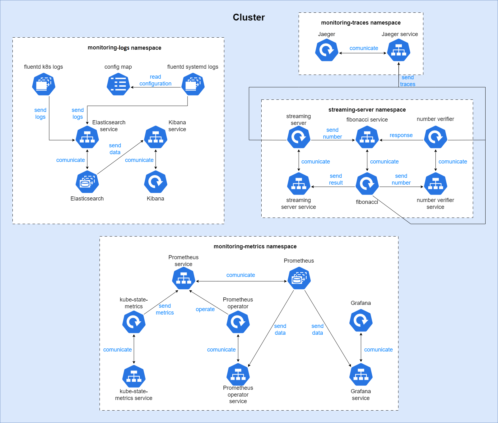

# Introduction
The goal of this project is to show different conceptions regarding: 
- Monitoring and Observability, especially of Kubernetes environments
- The Four Golden Signals of monitoring and The Three Pillars of Observability
- Monitoring metrics using kube-state-metrics, Prometheus and Grafana
- Collecting and agregating logs using EFK stack - Elasticsearch, Fluentd, Kibana. 
- Instrumenting applications with OpenTelemetry, collecting traces with it and analyzing them in Jaeger

# Setup
In order to run this project follow these steps:
* Download and install [ffmpeg](https://ffmpeg.org) and [helm](https://helm.sh/docs/intro/install/).
* If you'd like to stream your custom video prepare or download appropriate .mp4 file. For example here you can download full BigBuckBunny 10 minutes movie from here: http://commondatastorage.googleapis.com/gtv-videos-bucket/sample/BigBuckBunny.mp4, if not then you can use Sintel Trailer (sinteltrailer.mp4 file) that is provided by default.
* Place the .mp4 file in the *apps/streaming-server/* directory
* In the *apps/streaming-server/* directory run: ```./convert.sh -i MY_MOVIE_FILE.mp4```
* If you're on windows machine you can either configure WSL or make some (faster) workaround by downloading [GIT](https://git-scm.com/downloads). After downloading it you can either run the script from GIT Bash same as above or add a path to sh.exe file (for example: *C:\Program Files\Git\bin*) to PATH variable and run it from powershell like ```sh .\convert.sh -i MY_MOVIE_FILE.mp4```
* To run this app you need to have a prepared Kubernetes cluster. Easiest way to provide it is to run a local one-node cluster called `minikube`. To do that, download minikube and start it with `minikube start`.
* Deploy application by using script shown below. Give it some time to properly deploy all apps on the cluster and you're ready to go.
```
scripts/build_images_and_deploy.sh --rebuild-images --deploy-streaming-server --deploy-metrics --deploy-efk
```
* Use `minikube service streaming-server-service -n streaming-server` to access an application in a browser. It will automatically redirect you to the browser. If not - copy the printed IP with port and paste it in the browser. Do it analogically for jaeger service in order to reach Jaeger UI `minikube service jaeger-service -n monitoring-logs`. For Grafana UI simply visit http://localhost:2138.
* To simulate a workload on a streaming server web app use ```kubectl apply -f k8s/helpers/web-load-generator.yaml```. After that you will see HPA automatically deploying all replicas across the node.

# Kubernetes - theoretical introduction

Kubernetes is a powerful open-source platform for automating the deployment, scaling, and management of containerized applications. Born out of the need to efficiently manage container-based workloads at scale, Kubernetes provides a robust framework for orchestrating and coordinating the deployment of applications encapsulated in containers. It allows us to create certain objects with different kinds like `Pods`, `Deployments`, `Services` or `Autoscalers`

`Pods` in Kubernetes are the smallest deployable units, representing one or more containers that share the same network namespace, storage, and IP address. They serve as the basic building blocks for applications, allowing for efficient deployment, scaling, and management within the Kubernetes ecosystem.

`Deployments` in Kubernetes are resources that manage the deployment and scaling of applications. They use replica sets to maintain a specified number of `pod` replicas, supporting rolling updates and rollbacks for seamless application changes. Deployments provide a declarative configuration for easy management of the application's lifecycle, including scaling and updates.

`Services` in Kubernetes provide a stable endpoint to enable communication between pods. Acting as an abstraction layer, services helps with the discovery and load balancing of pods, ensuring seamless communication within a cluster.

`Daemonset` is a resource that ensures a copy of a specific pod runs on each node within a cluster, providing a way to run a specific workload on every node. It is often used for system-level tasks, monitoring agents, or other scenarios where each node in the cluster requires a dedicated instance of the pod.

`Statefulset` is a resource used for managing stateful applications, providing stable network identities and persistent storage for each pod. It ensures that each pod in the set maintains a unique and predictable identity, making it suitable for applications that require ordered deployment, scaling, and termination.

To fully demonstrate all mentioned possibilities of collecting and showing logs, traces and metrics we decided to run our applications on `minikube`.

`Minikube` is an open-source tool for running Kubernetes clusters locally on a single machine. It supports cross-platform use and easy installation via popular package managers or direct downloads. Minikube integrates with hypervisors (e.g., VirtualBox, Hyper-V) or can run Kubernetes nodes as containers using Docker.

To start a local Kubernetes cluster with one node we run a command:
```
minikube start
```

# Monitoring - theoretical introduction

## Why do we need monitoring and observability

Monitoring, including observability, helps analyze and understand systems in real-time. It provides reports and insights for effective management, quick response to issues, and improved performance and reliability. This continuous oversight ensures a proactive approach to addressing problems, making the system more robust and efficient.

## What is monitoring?

Monitoring is the process of collecting, analyzing, and utilizing information about a system. It is often mistakenly thought that monitoring solely focuses on observing metrics, especially the so-called "four golden signals", but it is a much more complex process. Nonetheless, the four golden signals remain important components of monitoring and we will use them in our project. 

### Golden signals

The four golden signals are given:

1. Latency: The time it takes to fulfill a request.
2. Traffic: An indication of the demand on your system, usually measured as specific to your system's overall activity. For a web service, this is commonly counted as HTTP requests per second.
3. Errors: The frequency of unsuccessful requests.
4. Saturation: How occupied your service is. It gauges your system's capacity, highlighting the resources under the most strain (e.g., in a system with limited memory, it reflects memory usage; in a system constrained by I/O, it reflects I/O).

## What is Observability?

Observability is the ability to understand the internal state of a system through the analysis of data it generates, such as logs, metrics, and traces. Observability helps analyze what is happening in the environment, allowing for the detection and resolution of encountered issues.

Keep in mind that observability, which is kind of a buzzword, is only an ability and can be included in the monitoring process, not the other way around. It's a common misconception popularized by companies that profit from observability solutions.

### Observability pillars

We can differentiate three main observability categories, often reffered to as the observability pillars:

1. Metrics - in this context, metrics refer to collections of measurements taken over time, and they come in various types:
- Gauge metrics: These measure a specific value at a particular moment, like the CPU utilization rate at the time of assessment.
- Delta metrics: These track variances between past and present measurements, indicating changes in metrics like throughput since the last measurement.
- Cumulative metrics: These record changes over an extended period, such as the cumulative count of errors returned by an API function call over the past hour.

2. Logs - Logs hold system and application details, revealing the inputs and outputs of operations and control flow. They document events like process starts, error handling, or task completions, all with a specific structure including timestamps and description of what happened. It allows logs to offer crucial insights into the system, shedding light on contributing factors and operational impact.

3. Traces - Distributed traces are the third pillar of observability, specifically designed for distributed microservices-based applications. An application may depend on multiple services, each having its own set of metrics and logs. Distributed tracing allows us to "follow" through various services that interact with each other within a request and visualize the dependencies between them.

We will 

# Architecture

To implement mentioned in the previous section observability pillars, a number of applications were deployed on the kubernetes cluster. The architecture of this solution is shown in the diagram below.



All resources are divided into 4 different namespaces. Namespaces components and functions are described below.

## streaming-server
In this namespace there are 3 deployments with their corresponding services:
- **streaming server** - contains a video streaming application. The application also contains a field for typing and calculating the fibonacci number. It sends the number to the fibonacci deployment through its service and receives the result from this service.
- **fibonacci** - receives the number to be calculated from the streaming server and sends it to the number verifier via its service and, depending on the response, calculates the given Fibonacci sequence number or returns information to the streaming server that it can’t make calculations. This application was introduced to show how recursive application affect monitoring, especially traces.
- **number verifier** - checks if the number sent by fibonacci is in range between 0 and 20 (if it's more than 20 then) and sends the result to the fibonacci service. The application was introduced only to have slightly more complex traces.

## monitoring-traces

There is only one deployment named Jaeger with its service that provides 2 ports. The first port is used to communicate with applications from which traces are collected and the second port is used for user interactions.

## monitoring-logs

In this namespace there are below resources:
- **config map** - contains the configuration, which is read by the fluentd instance of systemd logs,
deamonset fluentd systemd logs - contains the fluentd application that reads the configuration from the config map and is used to read logs from the cluster node and then sends them to statefulset Elasticsearch via its service,
- **fluentd k8s logs** - is a deamonset that collects logs from the kubernetes cluster and sends them to statefulset Elasticsearch via its service,
- **Elasticsearch** - statefulset, which receives data from both fluentd instances, saves it and sends it to deployment Kibana via its service,
- **Kibana** - deployment that receives data from Elasticsearch and visualizes it.

## monitoring-metrics

This namespace contains the following components:
- **kube-state-metrics** - deployment, which collects metrics from the entire kubernetes cluster and makes them available in one place. It sends them to statefulset Prometheus via its service.
- **Prometheus** - statefulset, which receives metrics from kube-state-metrics and saves them in  the Time Series Database. The data available to the Prometheus operator and Grafana is sent through their services.
- **Prometheus operator** - deployment that is used to operate Prometheus by the user and can influence the configuration of Prometheus. It can also read the stored data.
- **Grafana** - deployment, which receives data from Prometheus and visualizes it in the form of dashboards. Its service provides a port for the user to operate Grafana.

# Metrics

Metrics are statistics about a cluster and its resources such as nodes, deployments and others. They are used to analyze the performance of a containerized environment that runs multiple containers with applications inside. They make it possible to determine the potential cause of application errors and problems with the operation and performance of the cluster or its individual nodes. In order to determine the parameters regarding the performance of this environment, it is necessary to monitor the metrics. For this purpose, there were used kube-state-metrics, Prometheus and Grafana.

## Tools

### kube-state-metrics

Kube-state-metrics (KSM) is a simple service that listens to the Kubernetes API server and generates metrics about the state of the objects. It is focused on the health of the various objects inside, such as deployments, nodes and pods. This tool talks with Kubernetes clusters using client-go. It takes a snapshot of the entire Kuberentes state, uses that in-memory state to generate metrics and then serves them as plaintext on the /metrics endpoint and default port 8080. Kube-state-metrics gets raw data directly from the Kubernetes API and does not apply any modifications to the data it exposes. 

### Prometheus

Prometheus collects and stores metrics received from kube-state-metrics as time series data. Data is identified by metric name and key/value pairs. It is possible to create a query to the database using PromQL. It can be also available via web browser.

### Grafana

Grafana is a tool, which allows preparing data visualizations based on entries received from the time series prometheus database. Metrics associated with the same topic can be grouped in one dashboard. From a wide range of possible chart types, there can be chosen the most appropriate type for a certain metric. Dashboard configuration with metrics visualizations can be converted into JSON file and then imported to another instance of Grafana.

## Measured metrics

Metrics relate to various cluster resources. Therefore, in order to make an accurate analysis of the metrics, it is necessary to distinguish them and divide them into appropriate groups, which are called layers. This makes it possible to track down problems concerning a particular group, such as a specific node, which would be unnoticeable by analyzing only metrics concerning the cluster as a whole.

### Cluster layer

The cluster metrics layer provides general information about the cluster, its nodes, applications running on it and available resources of the entire cluster. The examined metrics are:
- `kube_node_status_condition` - metric determining nodes availability in the cluster,
- `kube_deployment_status_replicas_unavailable` and `kube_statefulset_status_replicas_unavailable` - metrics specifying the number of unavailable replicas for deployed deployments and statefulsets,
- `kube_deployment_spec_replicas` - number of pods running for specific deployments,
- `kube_node_status_allocatable` - determines resources such as the number of CPU cores, RAM and ephemeral memory for each node. These results are then aggregated to get a view for the resources of the entire cluster.


### Control plane layer

This layer provides information about the cluster's control plane and requests handling time directed to it. The state of the master node is checked through the `kube_node_status_condition` metric, while the requests handling time is presented as a combination of several metrics. The `GET`, `POST` and `PUT` operations for both deployments and statefulsets are distinguished here. An operation that determines the average handling time of requests sent by deployments was implemented using the following PromQL query:
```
sum by(verb) (apiserver_request_duration_seconds_sum{resource="deployments", verb!="LIST", verb!="WATCH", verb!="DELETE"}) /
sum by(verb) (apiserver_request_duration_seconds_count{resource="deployments", verb!="WATCH", verb!="LIST", verb!="DELETE"})
```
For statefulsets, the query looks like this:
```
sum by(verb) (apiserver_request_duration_seconds_sum{resource="statefulsets", verb!="LIST", verb!="WATCH", verb!="DELETE"}) /
sum by(verb) (apiserver_request_duration_seconds_count{resource="statefulsets", verb!="WATCH", verb!="LIST", verb!="DELETE"})
```


### Node layer

Node layer contains metrics, which describe individual cluster nodes. They allow obtaining information about the availability and consumption of node resources, delays in operations on them, reads and writes to the disk and network traffic load on a node. The examined metrics are:
- `kube_node_status_allocatable` - determines resources such as the number of CPU cores, RAM and ephemeral memory for the node,
- `kubelet_running_containers` - the number of running containers on a given node. It allows determining whether the containers are more or less evenly distributed among the nodes,
- `node_disk_io_time_seconds_total` - describes the number of I/O operations on the disk, transformed into the expression `rate (node_disk_io_time_seconds_total{instance="$internal_ip:9100"}[1m])`,
- `kubelet_runtime_operations_duration_seconds_sum` and `kubelet_runtime_operations_duration_seconds_count` - allow calculating the average duration of the tasks: `container_status`, `create_container`, `list_containers`, `remove_container`, `start_container`. For this purpose, the following PromQL query was performed:
```
kubelet_runtime_operations_duration_seconds_sum{node="$node", operation_type!="image_status", operation_type!="list_images", operation_type!="list_podsandbox",
operation_type!="podsandbox_status", operation_type!="port_forward", operation_type!="pull_image" , operation_type!="remove_podsandbox",
operation_type!="run_podsandbox", operation_type!="status", operation_type!="stop_podsandbox", operation_type!="update_runtime_config", operation_type!="version"}
/ kubelet_runtime_operations_duration_seconds_count{node="$ node", operation_type!="image_status", operation_type!="list_images",
operation_type!="list_podsandbox", operation_type!="podsandbox_status", operation_type!="port_forward", operation_type!="pull_image",
operation_type!="remove_podsandbox ", operation_type!="run_podsandbox", operation_type!="status", operation_type!="stop_podsandbox",
operation_type!="update_runtime_config", operation_type!="version"}
```
- `node_disk_reads_completed_total` - node disk read counter, represented as average number of operations over time using the query `rate (node_disk_reads_completed_total{instance="$internal_ip:9100"}[1m])`,
- `node_disk_writes_completed_total` - writes to the node's disk counter, represented as the average number of operations over time using the query `rate (node_disk_writes_completed_total{instance="$internal_ip:9100"}[1m])`,
- `node_network_receive_bytes_total` - counter of bytes received for a given node, presented as the average number of bytes received over time using the query `rate (node_network_receive_bytes_total{instance="$internal_ip:9100"}[1m])`,
- `node_network_transmit_bytes_total` - counter of bytes sent for a given node, presented as the average number of bytes sent over time using the query `rate (node_network_transmit_bytes_total{instance="$internal_ip:9100"}[1m])`,
- `node_disk_read_bytes_total` - counter of bytes read from the node's disk presented as the average number of bytes read from the disk of a given node using the query `rate(node_disk_read_bytes_total{instance="$internal_ip:9100"}[1m])`,
- `node_disk_written_bytes_total` - counter of bytes written to the node's disk presented as the average number of bytes written to the disk of a given node using the query `rate(node_disk_written_bytes_total{instance="$internal_ip:9100"}[1m])`


### Pod layer

This layer presents information about the pods running on the cluster, such as lifetime of that pod, resource consumption, requests and limits imposed on the pod. The following metrics are used here:
- `kube_pod_status_ready` - describes the status of a given pod,
- `kube_pod_status_container_ready_time` - the running time of the pod calculated using the `time() - kube_pod_status_container_ready_time{pod="$pod"}` expression,
- `container_cpu_usage_seconds_total` - describes the cumulative measure of CPU usage time since pod startup. This quantity was converted to average CPU core usage over time using the expression `rate(container_cpu_usage_seconds_total{pod="$pod"}[1m])`,
- `kube_pod_container_resource_requests` - describes the resources requested by pod: RAM and number of CPU cores,
- `kube_pod_container_resource_limits` - describes the imposed limits on the pod's use of resources: RAM and the node's CPU cores.


### Application layer

The lowest layer shows the operation of the application (container) inside the pod, resources it requests and the number of application restarts. The metrics in this layer are:
- `kube_pod_container_status_running` - specifies the status of the container,
- `kube_pod_container_status_restarts_total` - counter of container restarts,
- `kube_pod_container_resource_requests` - specifies the RAM and CPU cores requested by the container.


## Test scenarios

### Checking on cluster resources

To check whether a cluster or any node is running out of resources, such as RAM memory, ephemeral memory or CPU cores there is a need to look into two layers: cluster and node. In cluster node the total available resource of the entire cluster should be inspected. In the node layer, on the other hand, for each node there should be verified the available number of resources. If it turns out that any node begins to run out of resources, appropriate actions should be taken.

### Pod and application resources usage

To see whether the managed and assigned to the corresponding pod resources have gone to the containers running in it there should be checked the sizes of the requested  resources by the pod and then the sizes of the requested resources by all the containers in that pod should be added up.

# Logs

Efficient log collection is paramount for gaining insights into the health, performance, and behavior of applications and infrastructure on Kubernetes. Collecting logs from various components within a cluster is essential for troubleshooting issues, monitoring system activities, and ensuring overall system reliability.

Each application generates logs that can be collected, aggregated and sent for analyzis and visualization. To achieve that we decided to use well known EFK stack - consisting of Elasticsearch, Fluend and Kibana.

## Elasticsearch
Elasticsearch excels at indexing and searching large volumes of data quickly and efficiently. In the context of log management, Elasticsearch acts as the storage and retrieval mechanism for logs. Logs from various sources are ingested into Elasticsearch, where they are indexed and made searchable. Its distributed nature ensures scalability, allowing it to handle vast amounts of log data across a cluster of nodes. Within the Elasticsearch there is a logstash underneath that ingests, processes and forwards logs and events to various outputs. It serves as the middleware between input sources and Elasticsearch itself.

## Fluentd
Fluentd is a data collector that is used to be deployed on every node within a cluster to be able to collect logs from applications running on them. He collects all the data and sends it to the Elasticsearch. In our project we use two instances of fluentd. One is created to collect logs from Kubernetes applications specificly and the second one is used to collect logs from the Node. It uses a configuration that ingesting logs from /var/log/journal folder, place where the systemd sends all the logs about running services.

To collect logs from the minikube node it was necessary to change the config of the systemd under a /etc/systemd/journald.conf and point a location where all the logs should be stored. After that, under a /var/log/ directory 'journal' folder has been created and it was possible to catch all the logs by the fluentd.


## Kibana
When data are ingested, proceeded and properly tagged they are sent to Kibana, where we can actually discover and analyze all the logs across the apps and nodes. Kibana gives us multiple possibilites to visulize the data and explore it. It uses a KQL (Keyword Query Language) that enables us to construct complex queries and filter data, helping to narrow down and focus on specific information. It is possible to save our filters and use them after to create a dashboards.

When it comes to vizualisation Kibana provides a wide range of visualization options, allowing users to create interactive and customizable charts, graphs, tables, and maps. It supports various visualization types such as line charts, bar charts, pie charts, and heat maps, making it versatile for different data representation needs.

Users can aggregate multiple visualizations into cohesive dashboards. Dashboards in Kibana enable the comprehensive display of relevant information in a single view, facilitating the monitoring and analysis of complex data sets.


# Traces

Traces, the third pillar of Observability, play a crucial role, particularly in distributed environments like microservices architecture, which is frequently encountered in Kubernetes deployments. We used OpenTelemetry to collect and send (via collector) relevant traces and Jaeger to visualize and analyze them.

## OpenTelemetry

OpenTelemetry is a free, open-source, Observability framework and toolkit crafted for generating and handling telemetry data, including metrics, logs and, what is most important from this section's point of view, traces. OpenTelemetry supports many programming languages and frameworks and can be used with various vendors and tools, allowing its use with a wide range of Observability backends, including open source solutions like Jaeger.

### OpenTelemetry key concepts

Before we analyze our use of OpenTelemetry, let's take a look at some key concepts:
- `Signals`: OpenTelemetry collects, processes, and exports signals — system outputs describing the underlying activity of the operating system and applications. Examples of signals: metrics, logs, traces.
- `Instrumentation`: To make a system observable, its components must emit traces, metrics, and logs. This can be achieved through either manual coding against OpenTelemetry APIs or automatic instrumentation, which collects telemetry without bigger modifications of the source code.
- `Collector`: A proxy that receives, processes, and exports telemetry data. It supports various telemetry formats (e.g., OTLP, Jaeger, Prometheus) and can send data to multiple backends. The collector also facilitates processing and filtering telemetry data before export. We will use collector that is included in Jaeger all-in-one solution.
- `Traces`: Traces serve as examples of signals. They provide a holistic view of events during a request in an application, crucial for understanding its journey.
- `Tracer Provider`: Acts as a factory for Tracers, initialized once, aligning with the application's lifecycle.
- `Tracer`: Generates spans, offering details on specific operations like a request within a service.
- `Trace Exporters`: Dispatch traces to consumers, including debugging outputs, OpenTelemetry Collector, or preferred backends.
- `Context Propagation`: Core to Distributed Tracing, allowing correlation of Spans and assembly into a trace.
- `Spans`: Fundamental units of work in OpenTelemetry's tracing system.
- `Attributes`: Key-value pairs providing metadata to annotate a Span.
- `Span Events`: Structured log messages denoting significant points in a Span's duration.
- `Span Links`: Associate spans, indicating causal relationships; optional but useful for connecting trace spans.
- `Span Status`: Indicates if there's a known error in the application code.
- `Span Kind`: Categorizes spans into Client, Server, Internal, Producer, or Consumer, guiding how the trace is assembled.

More information about OpenTelemetry concepts can be found in the [documentation](https://opentelemetry.io/docs/).

### Our OpenTelemetry usage

We have used OpenTelemetry to extract traces from our three applications:
- nginx based streaming server,
- fibonacci application written in python with Flask framework,
- number verifier application written in python with Flask framework.

For nginx we have used ngx_http_opentelemetry_module.so module. Instructions for applying it can be found in the OpenTelemetry documentation: [link](https://opentelemetry.io/blog/2022/instrument-nginx/). Here's our nginx.conf content:

```
load_module /opt/opentelemetry-webserver-sdk/WebServerModule/Nginx/1.23.1/ngx_http_opentelemetry_module.so;

events {}
http {
	include /etc/nginx/conf.d/opentelemetry_module.conf;
	server {
		listen 8080;

		location / {
			types {
				application/vnd.apple.mpegurl m3u8;
				video/mp2t ts;
				application/dash+xml mpd;
                video/mp4 mp4;
                text/css css;
                text/html html;
            }
			root /usr/local/nginx/html;
		}

		location /fibonacci {
			proxy_pass http://fibonacci-service:5000;
			proxy_set_header Host $host;
			proxy_set_header X-Real-IP $remote_addr;
			proxy_set_header X-Forwarded-For $proxy_add_x_forwarded_for;
			proxy_set_header X-Forwarded-Proto $scheme;
		}
	}
}
```

Let's describe this file line by line as it may contain information helpful with understanding our distributed application as a whole:

1. `load_module /opt/opentelemetry-webserver-sdk/WebServerModule/Nginx/1.23.1/ngx_http_opentelemetry_module.so;`: This line loads the OpenTelemetry module for NGINX. It provides instrumentation for OpenTelemetry in NGINX, enabling observability and tracing capabilities.
2. `events {}`: This section is empty but reserved for specifying global settings related to the NGINX event processing system. In this case, there are no specific event-related configurations.
3. `http { ... }`: This block includes configurations specific to the HTTP server.
4. `include /etc/nginx/conf.d/opentelemetry_module.conf;`: This line includes additional OpenTelemetry configuration from opentelemetry_module.conf file.
5. `server { ... }`: This block defines the configuration for an HTTP server.
6. `listen 8080;`: This specifies that the server should listen on port 8080 for incoming connections.
7. `location / { ... }`: This block defines configuration for requests that match the location /. It specifies the types of content that can be served and sets the root directory for static files.
8. `types { ... }`: This block sets the content types for specific file extensions especially necessary for our streaming server.
9. `root /usr/local/nginx/html;`: This sets the root directory for serving static files to /usr/local/nginx/html.
10. `location /fibonacci { ... }`: This block configures NGINX to proxy requests with the path /fibonacci to our fibonacci microservice (its kubernetes service to be specific) on port 5000. It also sets several headers to pass along information about the client's request.

Now let's take a look at our usage in our Python-based fibonacci microservice but this time let's only consider only OpenTelemetry-related code:

```
tracer_provider = TracerProvider(resource=Resource.create({'service.name': 'fibonacci-microservice'}))
tracer_provider.add_span_processor(BatchSpanProcessor(OTLPSpanExporter(endpoint="http://jaeger-service.monitoring-traces.svc.cluster.local:4317", insecure=True)))
trace.set_tracer_provider(tracer_provider)
```
This code sets up the OpenTelemetry Tracer Provider. It configures a tracer with the name "fibonacci-microservice" and adds a batch span processor with an OTLP (OpenTelemetry Protocol) span exporter. The exporter sends spans to the specified Jaeger service for monitoring traces.

```
FlaskInstrumentor().instrument_app(app)
RequestsInstrumentor().instrument()
```
This code instruments the Flask application and the Requests library for OpenTelemetry. It's an example of automatic instrumentation which means that we don't have to, for example, set span contexts' manually as it will be done automatically. It makes using OpenTelemetry incredibely easy.

```
@app.route('/fibonacci/<int:number>', methods=['GET'])
def fibonacci(number):
    with trace.get_tracer(__name__).start_as_current_span("fibonacci-calculation"):
        # Rest of the code: Perform Fibonacci calculation based on the provided number.
```
Here we can see an example of how to start a span.

We won't describe number-verifier code as it's analogical, only with different names in some places. 

And that's it, applying OpenTelemetry is really simple if we don't want any specific informations that can be derived only from manual instrumentation. Remember than OpenTelemetry supports wide variety of programming languages and frameworks, it's not only Python and Flask and moreover it's comparatively as easy.


## Jaeger

Jaeger, an open-source distributed tracing platform introduced by Uber Technologies, offers the capability to:

- Monitor and resolve issues in distributed workflows
- Pinpoint performance bottlenecks
- Investigate root causes
- Analyze dependencies between services

Jaeger allowed us to analyze and visualize traces that were previously collected and sent via OpenTelemetry.

We've used Jaeger all-in-one for our purposes. It's an executable designed for quick local testing. It includes the Jaeger UI, jaeger-collector, jaeger-query, and jaeger-agent, with an in memory storage component.

## Traces demonstration

To illustrate our traces in action, let's begin by examining the main page:


As you can see there is a fibonacci form in which you can enter some number, let's say N in order to get N-th fibonacci number. After submitting this form the number you've provided will be sent to the fibonacci microservice, which then will forward this number to the number verification microservice in order to check if the number is within the desired interval (from 0 to 20). It will return appropriate result to the fibonacci microservice and if the result is valid then the fibonacci app will perform appropriate calculation using a recursive approach. Finally the result will be returned to the streaming server and will be visible to the user as below:


Now let's explore what we have in Jaeger:


As we can see in the visualization of the request that we've just described, there is a trace consisted of multiple spans and spans from each application have different colors. We can clearly see the correlation between them, including control flow between nginx modules, recursive calls in the fibonacci microservice, along with some additional informations like span attributes.

Thanks to traces, we can have a deeper understanding of our distributed systems, look for potential bottlenecks and improvements, investigate problems in our system and analyze dependencies between services, everything in visually-appealing way.

# Bibliography
- https://sre.google/sre-book/monitoring-distributed-systems/
- https://www.dynatrace.com/news/blog/observability-vs-monitoring/
- https://prometheus.io/docs/
- https://grafana.com/docs/grafana/latest/
- https://github.com/kubernetes/kube-state-metrics
- https://grafana.com/blog/2023/01/25/monitoring-kubernetes-layers-key-metrics-to-know/
- https://www.elastic.co/guide/en/kibana/current/index.html
- https://docs.fluentd.org
- https://www.elastic.co/guide/en/elasticsearch/reference/current/index.html
- https://opentelemetry.io/docs/what-is-opentelemetry/
- https://www.jaegertracing.io/docs/1.52/
- https://opentelemetry.io/docs/instrumentation/python/
- https://opentelemetry.io/blog/2022/instrument-nginx/
